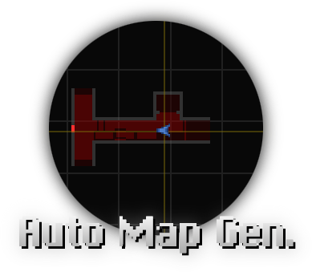

<h1 align="center">
    
    <br>R3 Auto Map Gen<br>
    <p align="center">
        
        
    </p>
</h1>
  
This app creates an node-conected map on the go for classic Resident Evil games.

## How to install
- Download [latest release](https://github.com/themitosan/R3-Auto-Map-Gen/releases) _(or the latest build from [GitHub Actions](https://github.com/themitosan/R3-Auto-Map-Gen/actions))_
- Extract the zip on a _cool-looking_ place
- Run `R3 Auto Map Gen.exe`
- Click on `App Setup`, select your game executable and then insert ram positions for current stage and room.

...If everything is fine, just open your game - go to main menu and then click on `Hook game process`.

## How this thing works?
- Open your game, start hook, transition from one room to other and **see the magic**!

<p align="center">

</p>

## Where this thing can be helpful?
_...Do you have heard about the word of **[BioRand](https://github.com/IntelOrca/biorand)**?_

## Shortcuts
You can find a list with all available shortcuts on `help.txt`.

## How to build

> [!IMPORTANT]\
> Make sure to have latest [node.js](https://nodejs.org) version installed!

- Run `npm run build-normal` for common build or `npm run build-sdk` for debug build.
- You can also use `npm run build-normal-wine` or `npm run build-sdk-wine` to compile a version that plays nicer with [wine](https://www.winehq.org) compat layer.

If everything is okay, binaries will be available on `build/r3_auto_map_gen/`.

## Other OS?
You can run this app using [Wine](https://www.winehq.org) compat layer.
In order to read current game, **make sure to run it under the same prefix**.

Or, you can run R3 Auto Map Gen with same RE wine args!

```shell
# You can use this command below to run Resident Evil 3: Nemesis + Classic Rebirth DLL
WINEDLLOVERRIDES="ddraw.dll=n,b" wine64 R3\ Auto\ Map\ Gen.exe

# Steam Deck or Proton? Sure! Use add this command to launch options
WINEDLLOVERRIDES="ddraw.dll=n,b" %command%
```

<p align="center">

</p>

<sup>

_(R3 Auto Map Gen running using wine version on Cinnamon, Arch Linux)_

</sup>

## External plugins on this project
- [memoryjs](https://github.com/rob--/memoryjs) from [Rob--](https://github.com/rob--)
- [TMS.js](https://github.com/themitosan/TMS.js) from [TheMitoSan](https://github.com/themitosan) <sup>_Hi!_</sup>

<br>
<sup>

_[BioRand](https://github.com/IntelOrca/biorand) is a Classic Resident Evil Randomizer created by [IntelOrca](https://github.com/IntelOrca)._

_Some parts from this project was obtained from [R3ditor V2](https://github.com/themitosan/R3ditor-V2) and R3V3._

_Code Veronica database was created using [Evil Resource](https://evilresource.com/resident-evil-code-veronica/maps) as reference._

</sup>